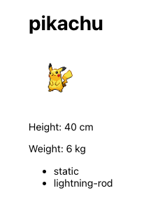
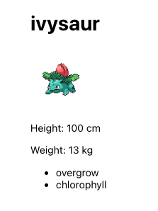

# Which Pokémon?

Create the react app with the following command:

```bash
npx create-react-app which-pokemon
npm start
```
or 
```bash
npm create vite@latest which-pokemon
npm install && npm run dev
```




This project was bootstrapped with [Create React App](https://github.com/facebook/create-react-app).
